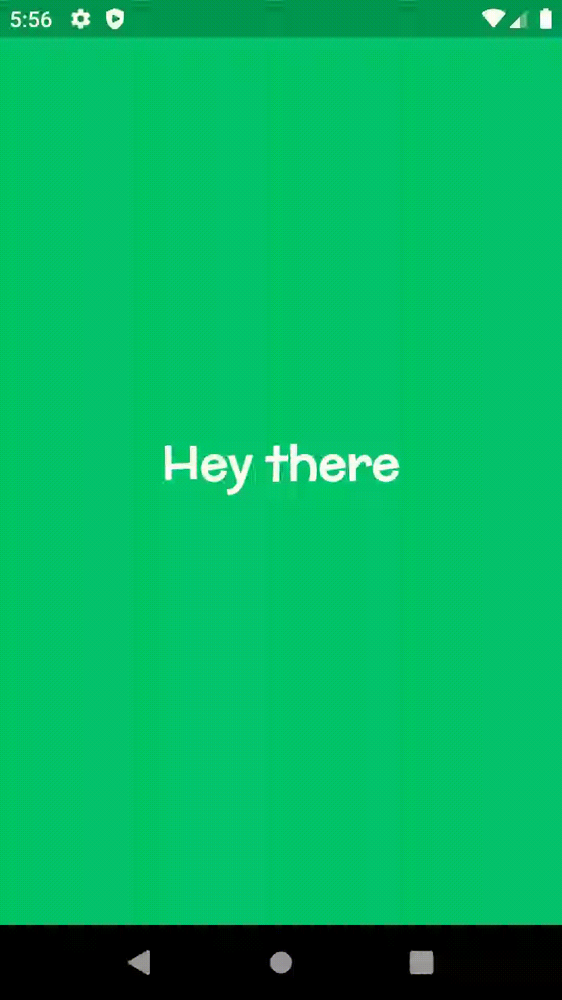

# Hey_There_App

Test task:

1. Install Flutter
2. Create a test application
3. The application should: display the text "Hey there" in the middle of the screen and after tapping anywhere on the screen a background color should be changed to a random color. You can also add any other feature to the app - that adds bonus points
4. Please do not use any external libraries for color generation
5. Push code to a GitHub
6. Send the link to a GitHub repository back

# Result

Application displays text "Hey there" in the center of the screen. Background color is generated randomly. If tap anywhere on the screen - background color will be changed to another randomly generated color. Color transition is performed with implicit animation and text animation as well. To keep text readable, its color changes to black or white based on current background color.

# App Demo

